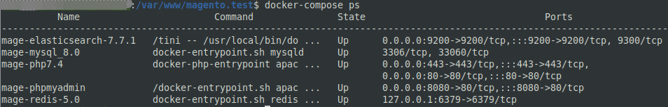
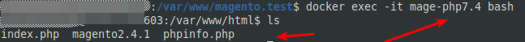
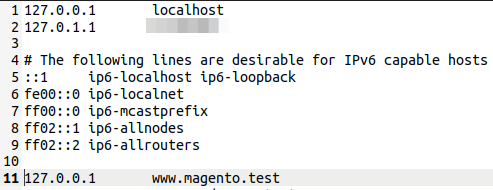
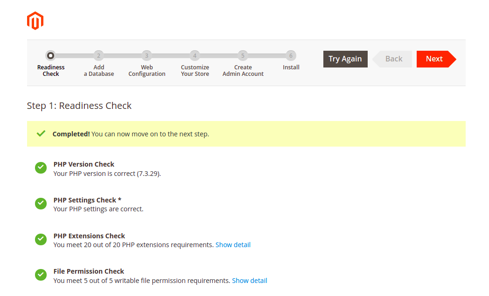
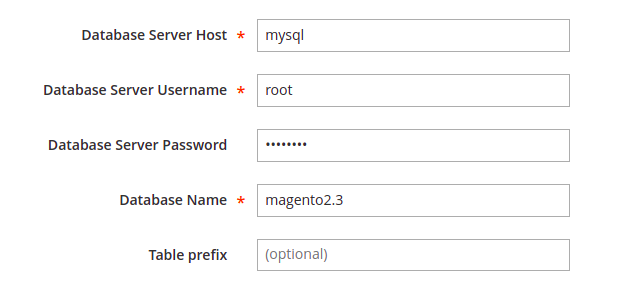
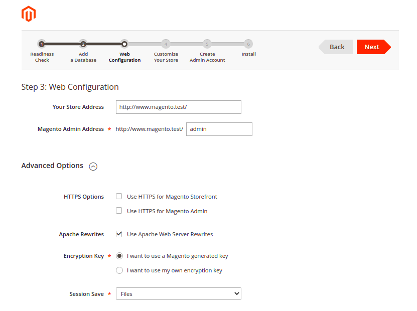
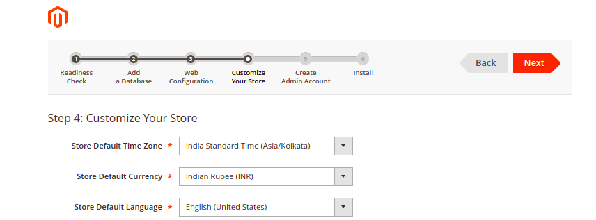
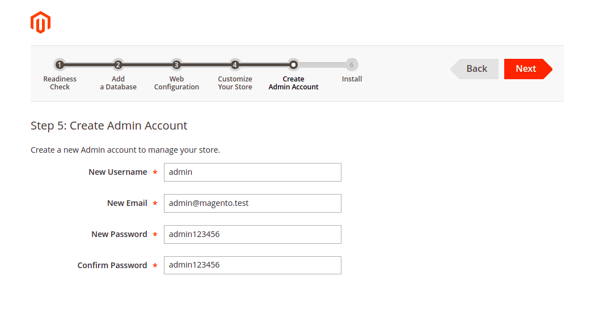
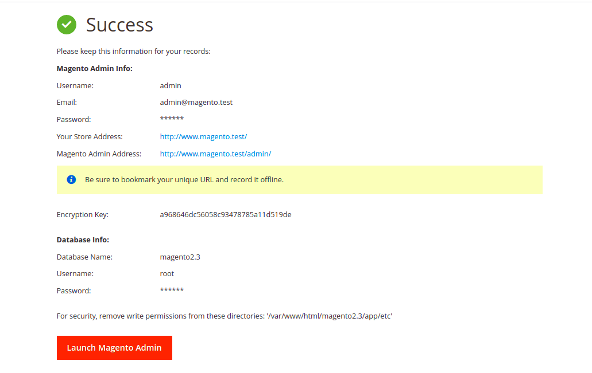
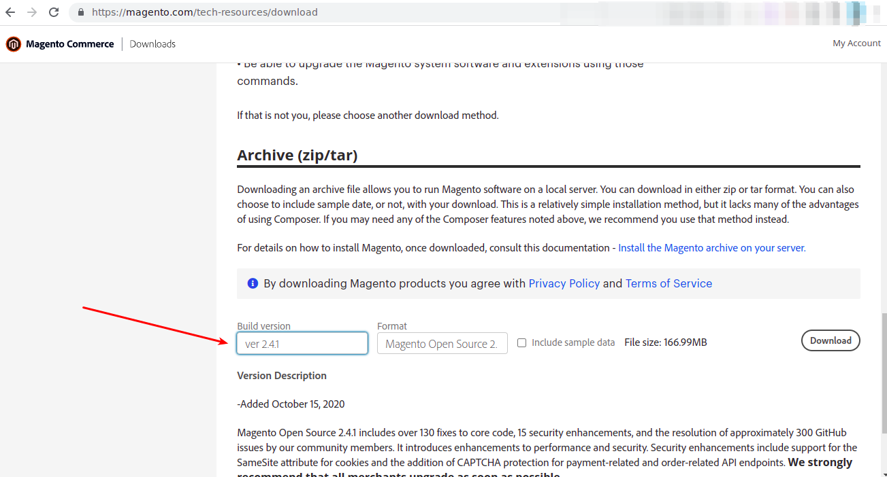

### HK2-Magento242-Docker - Complete Docker Setup for using Magento 2.4.2

#### Magento 2.3.4 & 2.4.2 Compatible

-   Includes Apache, PHP7.4, MySQL8.0, ElasticSearch 6.0, PHPMyAdmin, Adminer & Redis(5.0)/OpCache
-   Fully Magento2.4 Compatible - Includes all PHP Extension for Magento2.4 like curl, json, zip, gettext, exif, imagick, etc
-   Includes Git2 & Composer2
-   Includes 1 Virtual Host (http://www.magento.test)
-   .env file is used for Environment Variables.
-   Php Version & MySQL version can be changes to 7.3 using .env file
-   You can use either Adminer or PHPMyAdmin as per your needs in Docker Compose File. At a time only PHPMyAdmin or Adminer can be used.
-   Solved PHPMyAdmin Error - The phpMyAdmin configuration storage is not completely configured, some extended features have been deactivated.
-   Adds Default User other than Root User, so as to remove folder permission.
-   Please use Database server host as `mysql`
-   You can change composer to MySQL5 & PHP 7.3 & Disable Redis & ElasticSearch to make it compatible with Magento 2.3.4. Check .ENV File - Its well Commented.

### Prerequisites:

You must have Docker Installed in your System ! Docker version >= 20.10.x & Docker Compose version >= 1.25.x

### How to use this Docker Compose

`$ docker-compose build --no-cache`

`$ docker-compose up -d --remove-orphans`

#### Then you can check the status of the containers by running:

`$ docker ps`

#### Docker Bash:

`$ docker exec -it lampp-php7.3 bash`

### Docker Laravel Commands

`$ php artisan serve --host=www.laravel.test --port=8000`

### Url Links

1. [LocalHost (http://localhost)](http://localhost 'Localhost')
2. [PHPMyAdmin (http://localhost:8080)](http://localhost:8080 'PHPMyAdmin')
3. [Adminer (http://localhost:8080)](http://localhost:8080 'Adminer')

### Virtual Host

1. [WordPress (http://www.wordpress.test)](http://www.wordpress.test 'WordPress')

**Dont Forget to Add it to your Host File**

1. Windows Host File - `c:\Windows\System32\Drivers\etc\hosts`
2. Ubuntu Host File - `sudo nano /etc/hosts`

**ADD THESE**

1. `127.0.0.1 www.magento.test`

### Magento 2.3 Compatibility Test Screenshots (Shows all required extensions are fulfilled)

### Download Links for Magento & WordPress

1. [Download Magento 2.4 (https://magento.com/tech-resources/download)](https://magento.com/tech-resources/download 'Download Magento 2.4')
   

> This is a Non Production Docker Compose. This is just for Local Test Development
